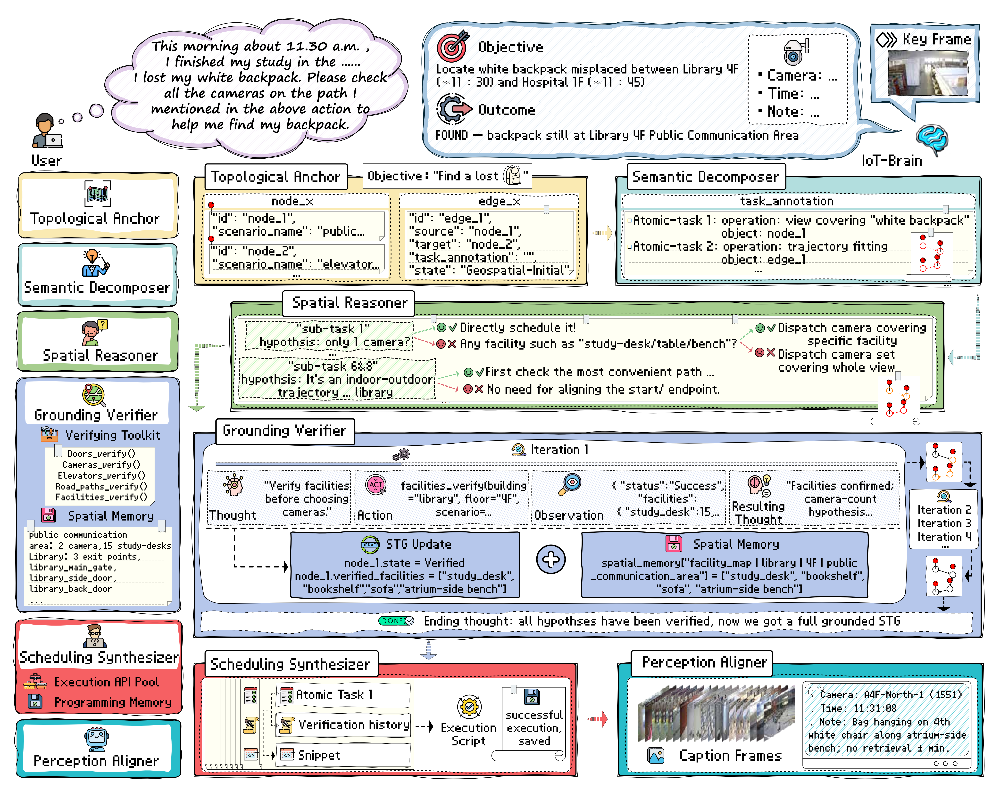
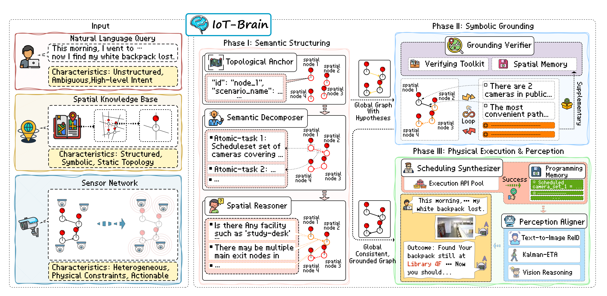

#  *IoT-Brain*: Intelligent Sensor Scheduling via Progressive Grounding

<p align="center">   <a href="#"></a>   <a href="#"></a>   <a href="#"></a> </p>

<p align="center">   
    <em>A multi-agent framework that translates high-level human intent into intelligent, on-demand sensor scheduling plans for large-scale IoT environments.</em> 
</p>

---

## 🌟 Overview 

The integration of Large Language Models (LLMs) with the Internet of Things (IoT) promises a new era of intelligent physical systems. However, a fundamental challenge remains: in a world blanketed by sensors, **which sensors should an agent use to perceive the world and solve a user's query?** 

**IoT-Brain** addresses this critical bottleneck of on-demand sensor scheduling. It introduces the **Spatial Trajectory Graph (STG)**, a novel neuro-symbolic paradigm that reframes complex scheduling tasks into a process of progressive, verifiable plan refinement. Instead of reacting blindly, IoT-Brain first hypothesizes a comprehensive plan and then systematically grounds it against a real-world model through a "verify-before-commit" loop. 

This repository provides the official implementation of the IoT-Brain framework and a demonstration version of the **TopoSense-Bench** benchmark, as described in our submission. 

<p align="center">    
    <br>
    <em>Figure 1: Overview of the IoT-Brain framework pipeline.</em>
</p>


## 🏛️ Framework Architecture

IoT-Brain employs a structured three-phase pipeline, orchestrated by a `MainController` that dispatches tasks to a series of specialized agents. This design ensures robustness and verifiability by decoupling planning from execution. 

<p align="center">    
<br>
<em>Figure 2: Overview of the IoT-Brain framework pipeline.</em>
</p>

- **Phase I: Semantic Structuring (Anchor, Decomposer, Reasoner)**    
  - `TopologicalAnchor`: Parses the raw query into an initial graph of spatial entities.   
  - `SemanticDecomposer`: Breaks down the user's goal into a robust, logical list of atomic sub-tasks.    
  - `SpatialReasoner`: Enriches the plan with specific, verifiable hypotheses for each sub-task. -   

- **Phase II: Symbolic Grounding (Verifier)**    
  -  `GroundingVerifier`: The core of our "verify-before-commit" strategy. It operates in a **Thought-Action-Observation (TAO)** loop, using a `VerificationToolkit` to rigorously validate every hypothesis against a world model (the knowledge base). This ensures the final plan is topologically consistent and physically plausible. 

- **Phase III: Physical Execution & Perception (Synthesizer, Aligner)**   
  -  `SchedulingSynthesizer`: Compiles the fully grounded plan into an executable Python script, leveraging a `ProgrammingMemory` of successful past examples to generate high-quality code. 
  -  `PerceptionAligner` (Conceptual): The final stage that would execute the script, orchestrate sensor activation, and analyze sensor data to provide the final answer to the user. 

## 🚀 Quick Start & Reproducibility 

This repository is structured to ensure full reproducibility of the results presented in our paper. 

**1. Clone the Repository** 

```bash git clone https://github.com/houqiii/IoT-Brain.git ```

```cd iot-brain```

**2. Set Up a Virtual Environment**

```bash
python -m venv venv
# On macOS/Linux:
source venv/bin/activate
# On Windows:
.\\venv\\Scripts\\activate
```

**3. Install Dependencies**

```bash
pip install -r requirements.txt
```

**4. Configure Your API Key**

Create a `.env` file in the root directory and add your API key. You can copy the provided template:

```bash
cp .env.example .env
```

Then, open the `.env` file and add your `OPENAI_API_KEY`.

**5. Run the Main Demo**
Execute the main controller to process a sample query. All five stages of the pipeline will be logged to the console.

```bash
python -m iot_brain.main_controller
```


## 🗺️ TopoSense-Bench: Demo Version

**TopoSense-Bench** is a new large-scale benchmark designed for this task, constructed from a real-world campus environment deployed with **over 2,000 cameras**.

To protect the privacy and sensitive information of the real-world deployment site, the full version of the benchmark will be made available online after a thorough anonymization and review process upon acceptance of our work.

This repository includes a comprehensive **demo version** of the benchmark, which is fully functional for testing the framework's capabilities:

- The complete topology of the **Faculty Center 1F**, featuring over 40 diverse scenarios (lounges, sports spaces, storage rooms, etc.).
- The complete outdoor **campus-wide road network**.

This allows for the replication of a wide range of intra-building and inter-building scheduling tasks as described in our experiments.

### Example Queries You Can Try

You can easily test the system by modifying the query variable at the bottom of iot_brain/main_controller.py with the following examples:

- **Single-location Perception:**

  > "Could you check if there is a lost backpack in the lounge on the 1st floor of the faculty center?"

- **Simple Scene Awareness:**

  > "Are there anyone doing exercise in the sports-space at faculty center 1F?"

- **Intra-building Trajectory:**

  > "I had breakfast in the lounge, and finally do exercise in the sports-space at faculty center 1F this morning. I found my mobile phone lost. Please help me look for it in all the places I might pass by."

## 📜 License

The code in this repository is licensed under the MIT License. See the [LICENSE](https://github.com/houqiii/IoT-Brain/blob/main/LICENSE) file for details.


