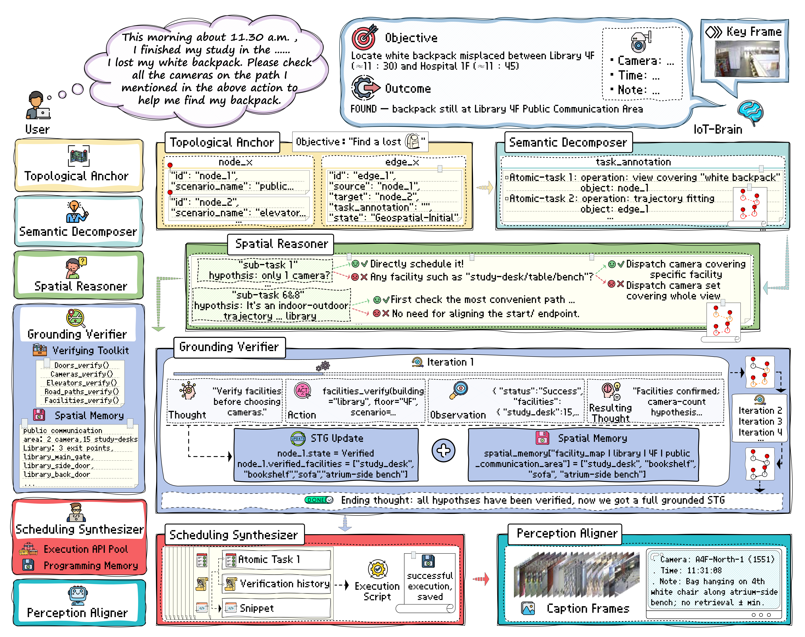
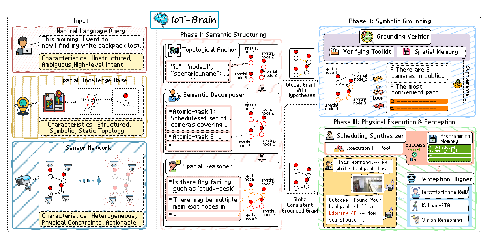

#  *IoT-Brain*: Intelligent Sensor Scheduling via Progressive Grounding of Spatial Trajectory Graphs

<p align="center">   <a href="#"></a>   <a href="#"></a>   <a href="#"></a> </p>

<p align="center">   
    <em>A multi-agent framework that translates high-level human intent into intelligent, on-demand sensor scheduling plans for large-scale IoT environments.</em> 
</p>

---

## 🌟 Overview 

The integration of Large Language Models (LLMs) with the Internet of Things (IoT) promises a new era of intelligent physical systems. However, a fundamental challenge remains: in a world blanketed by sensors, **which sensors should an agent use to perceive the world and solve a user's query?** 

**IoT-Brain** addresses this critical bottleneck of on-demand sensor scheduling. It introduces the **Spatial Trajectory Graph (STG)**, a novel neuro-symbolic paradigm that reframes complex scheduling tasks into a process of progressive, verifiable plan refinement. Instead of reacting blindly, IoT-Brain first hypothesizes a comprehensive plan and then systematically grounds it against a real-world model through a "verify-before-commit" loop. 

This repository provides the official implementation of the IoT-Brain framework and a demonstration version of the **TopoSense-Bench** benchmark, as described in our submission. 

<p align="center">    
    <br>
    <em>Figure 1: Overview of the IoT-Brain framework pipeline.</em>
</p>


## 🏛️ Framework Architecture

IoT-Brain employs a structured three-phase pipeline, orchestrated by a `MainController` that dispatches tasks to a series of specialized agents. This design ensures robustness and verifiability by decoupling planning from execution. 

<p align="center">    
<br>
<em>Figure 2: Overview of the IoT-Brain framework pipeline.</em>
</p>

- **Phase I: Semantic Structuring (Anchor, Decomposer, Reasoner)**    
  - `TopologicalAnchor`: Parses the raw query into an initial graph of spatial entities.   
  - `SemanticDecomposer`: Breaks down the user's goal into a robust, logical list of atomic sub-tasks.    
  - `SpatialReasoner`: Enriches the plan with specific, verifiable hypotheses for each sub-task. -   

- **Phase II: Symbolic Grounding (Verifier)**    
  -  `GroundingVerifier`: The core of our "verify-before-commit" strategy. It operates in a **Thought-Action-Observation (TAO)** loop, using a `VerificationToolkit` to rigorously validate every hypothesis against a world model (the knowledge base). This ensures the final plan is topologically consistent and physically plausible. 

- **Phase III: Physical Execution & Perception (Synthesizer, Aligner)**   
  -  `SchedulingSynthesizer`: Compiles the fully grounded plan into an executable Python script, leveraging a `ProgrammingMemory` of successful past examples to generate high-quality code. 
  -  `PerceptionAligner` (Conceptual): The final stage that would execute the script, orchestrate sensor activation, and analyze sensor data to provide the final answer to the user. 


## 🛠️ API Toolkits: The Engine of Grounding and Execution

The interaction between the IoT-Brain framework and the world model is mediated by two well-defined API toolkits. These deterministic, code-based libraries form the foundation of our "verify-before-commit" principle, ensuring that all LLM-driven plans are rigorously grounded in reality before execution.

### Verification Toolkit

Used by the `GroundingVerifier` to resolve ambiguities in the hypothesized plan. This set of APIs queries the static world model to turn semantic uncertainties into concrete facts.

| API Signature                   | Description                                                  | Example Call & Return                                        |
| ------------------------------- | ------------------------------------------------------------ | ------------------------------------------------------------ |
| `cameras_verify(loc, sce)`      | Retrieves a summary of cameras within a specified location or scenario. | `call: cameras_verify('library', ...)`<br>`return: "The location has 2 cameras."` |
| `facilities_verify(loc, sce)`   | Queries the types and counts of facilities (e.g., desks, podiums) within an indoor scenario. | `call: facilities_verify('library', ...)`<br>`return: "Facilities: desk: 30, podium: 1"` |
| `doors_verify(loc, [sce])`      | Returns a list of all entry/exit door nodes for a given building or a specific indoor scenario. | `call: doors_verify('library')`<br>`return: "Doors: library_main_door, ..."` |
| `elevators_verify(loc)`         | Queries all elevator nodes within a specific indoor location (e.g., a building floor). | `call: elevators_verify('teaching_bldg_3F')`<br>`return: "Elevators: elevator_3F_1, ..."` |
| `road_paths_verify(start, end)` | Enumerates all feasible outdoor paths between two building locations, returning their IDs, lengths, and connecting door nodes. | `call: road_paths_verify('library', 'hospital')`<br>`return: "[{'path_id': 'P1', ...}]"` |

### Execution API Pool

Used by the `SchedulingSynthesizer` to compile the final executable script. This high-level API pool abstracts away the complexities of data loading and deterministic optimization algorithms, providing six clear, function-oriented interfaces.

#### **`road_path_trajectory_fitting(start_location: str, dest_location: str, start_point: Optional[str]=None, dest_point: Optional[str]=None) -> List[Node]`**

* **Functionality**<br>
  Computes the globally shortest outdoor route between two buildings, optionally anchored at specified door nodes. This API automatically loads the main campus map.

* **Parameters**<br>
  `start_location`, `dest_location`: *str* – Names of the origin and destination buildings (e.g., "library").<br>
  `start_point`, `dest_point`: *Optional[str]* – Canonical names of specific start/end doors (e.g., "library_B_door"), used to constrain the path.

* **Example**

  ```python
  # The API pool is initialized once at the start.
  api_pool = ExecutionAPIPool(topology_data_path)
  
  # Directly call the high-level API.
  traj = api_pool.road_path_trajectory_fitting(
      start_location='library', 
      dest_location='teaching-building-1',
      start_point='library_B_door'
  )
  ```

* **Returns**<br>
  An ordered `List[Node]` of road vertices, intersections, and door nodes representing the optimal path.

#### **`road_path_camera_search(path_nodes: List[Node]) -> List[Node]`**

* **Functionality**<br>
  Retrieves all camera nodes installed on, or monitoring, any road segment of a given outdoor trajectory.

* **Parameters**<br>
  `path_nodes`: *List[Node]* – The node list representing a trajectory, typically the output of `road_path_trajectory_fitting`.

* **Example**

  ```python
  # `traj` is the output from the previous example.
  cameras_on_path = api_pool.road_path_camera_search(traj)
  ```

* **Returns**<br>
  A `List[Node]` containing all camera nodes that monitor the provided outdoor path.

#### **`indoor_path_search(location_name: str, location_door_dict: Dict, entrance_door: Optional[str]=None) -> List[Node]`**

* **Functionality**<br>
  Computes the shortest traversable path through indoor corridors connecting multiple rooms, respecting user-specified door constraints. It automatically loads the required indoor map.

* **Parameters**<br>
  `location_name`: *str* – The identifier for the indoor map to load (e.g., "faculty_center_1F").<br>
  `location_door_dict`: *Dict* – A mapping from room names to specific door names, e.g., `{'room-A': 'door-A1', 'room-B': None}`.<br>
  `entrance_door`: *Optional[str]* – A fixed start door for the entire indoor trajectory.

* **Example**

  ```python
  loc_dict = {'duty-room': None,
              'exhibition-hall': 'exhibition_hall_door'}
              
  indoor_traj = api_pool.indoor_path_search(
      location_name='faculty_center_1F', 
      location_with_door_dict=loc_dict
  )
  ```

* **Returns**<br>
  An ordered `List[Node]` representing the fitted indoor path.

#### **`indoor_path_camera_search(location_name: str, path_nodes: List[Node]) -> List[Node]`**

* **Functionality**<br>
  Selects the smallest camera subset whose sensing radii cover every point of a given indoor trajectory.

* **Parameters**<br>
  `location_name`: *str* – The identifier for the indoor map where the path is located.<br>
  `path_nodes`: *List[Node]* – The node list representing an indoor path.

* **Example**

  ```python
  # `indoor_traj` is the output from the previous example.
  cameras_on_indoor_path = api_pool.indoor_path_camera_search(
      location_name='faculty_center_1F', 
      path_nodes=indoor_traj
  )
  ```

* **Returns**<br>
  A `List[Node]` containing camera nodes that cover the indoor trajectory.

#### **`camera_coverage_search(location_name: str, scenario_name: str) -> List[Node]`**

* **Functionality**<br>
  Solves an integer-linear program to find the *minimal* set of cameras that jointly cover a specified indoor scenario (e.g., a hall or a large room).

* **Parameters**<br>
  `location_name`: *str* – The identifier for the indoor map to load.<br>
  `scenario_name`: *str* – The specific scenario identifier within the map (e.g., "teaching-building-1F-hall").

* **Example**

  ```python
  coverage_cams = api_pool.camera_coverage_search(
      location_name='teaching_building_1_1F', 
      scenario_name='teaching-building-1F-hall'
  )
  ```

* **Returns**<br>
  A `List[Node]` of selected camera nodes that provide maximum coverage for the target region.

#### **`scenario_object_location(location_name: str, scenario_name: str, object_name: str) -> List[Node]`**

* **Functionality**<br>
  Finds the camera(s) nearest to a named facility or object within a specific scenario, used for targeted monitoring.

* **Parameters**<br>
  `location_name`: *str* – The identifier for the map where the scenario is located.<br>
  `scenario_name`: *str* – The name of the scenario containing the object.<br>
  `object_name`: *str* – The canonical name of the target facility or object (e.g., "cafe_dining_table_29").

* **Example**

  ```python
  target_cam = api_pool.scenario_object_location(
      location_name='teaching_building_1_1F',
      scenario_name='cafe',
      object_name='cafe_dining_table_29'
  )
  ```

* **Returns**<br>
  A `List[Node]` containing the camera node(s) monitoring the object.


## 🤖 Agent Prompt Templates

The collaborative behavior of the agents within IoT-Brain is guided by a set of carefully crafted prompts that operationalize the STG paradigm. To ensure full reproducibility, this section provides the core system prompts for each key agent, corresponding to the three phases of STG construction and execution.

The agents are presented in their logical order of operation:

*   **Phase I: Semantic Structuring**
    *   *Topological Anchor*: Instantiates the initial STG vertices from the query.
    *   *Semantic Decomposer*: Establishes the graph's preliminary topology and annotates it with atomic sub-tasks.
    *   *Spatial Reasoner*: Enriches the graph with a comprehensive set of verifiable hypotheses.
*   **Phase II: Symbolic Grounding**
    *   *Grounding Verifier*: Systematically validates hypotheses through an iterative, tool-use-based loop.
*   **Phase III: Physical Execution & Perception**
    *   *Scheduling Synthesizer*: Compiles the fully-grounded STG into an executable program.
    *   *Perception Aligner*: Orchestrates the program's real-time execution and performs multimodal analysis.

---

### Topological Anchor Profiling Prompt

```tex
You are the Topological Anchor Agent, a specialized AI for the IoT-Brain
framework. Your sole responsibility is to parse a user's query and construct
an initial Spatial Trajectory Graph (STG) by identifying only the explicitly
mentioned locations as nodes and defining the traversal type between them
as edges.

You must operate strictly based on the rules below and return ONLY a single,
valid JSON object. Do not add any conversational text or explanations.

---
Output JSON Schema
---
{
  "objective": "<string, A concise summary of the user's ultimate goal>",
  "nodes": [
    {
      "id": "<string, e.g., 'node_1'>",
      "semantic_name": "<string, The name of the location/space, e.g.,
                      'public communication area'>",
      "floor": "<string, The floor level, e.g., '4F', 'B1', or null>",
      "building": "<string, The building name, e.g., 'library', or null>",
      "type": "<string, Must be 'indoor' or 'outdoor'>",
      "specific_facilities": ["<string, A list of mentioned facility *types*,
                             e.g., 'desk', 'door'. Empty if none.>"]
    }
  ],
  "edges": [
    {
      "id": "<string, e.g., 'edge_1'>",
      "source": "<string, The source node_id>",
      "target": "<string, The target node_id>",
      "transition_type": "<string, Must be one of: 'intra-building',
                      'inter-building', 'outdoor-to-indoor',
                      'indoor-to-outdoor', 'outdoor-to-outdoor'>",
      "description": "<string, A brief, human-readable description of
                     the traversal>"
    }
  ]
}

---
Core Directives for STG Construction
---
1.  **Identify Explicit Nodes Only**: Create a `node` ONLY for each distinct,
    explicitly mentioned location in the query. DO NOT insert any
    intermediate nodes like "corridor", "hallway", or
    "outdoor-road-network".

2.  **Node vs. Facility**: A `Node` is a space (room, lobby). A `Facility`
    is an object within a space (desk, door, elevator). Facilities are
    listed in the `specific_facilities` array of their containing node;
    they are NEVER nodes themselves.

3.  **Direct Edge Connection**: Connect sequential nodes directly with an
    `edge`. An edge from a node in Building A to a node in Building B
    represents the entire, complex journey between them.

4.  **Determine `transition_type`**: This is the most critical step. You
    MUST determine the `transition_type` for each edge by comparing the
    `source` and `target` nodes:
    -   `intra-building`: If `source.type` is 'indoor' AND `target.type`
        is 'indoor' AND `source.building` is the SAME as `target.building`.
    -   `inter-building`: If `source.type` is 'indoor' AND `target.type`
        is 'indoor' BUT `source.building` is DIFFERENT from `target.building`.
    -   `indoor-to-outdoor`: If `source.type` is 'indoor' and `target.type`
        is 'outdoor'.
    -   `outdoor-to-indoor`: If `source.type` is 'outdoor' and `target.type`
        is 'indoor'.
    -   `outdoor-to-outdoor`: If `source.type` is 'outdoor' and `target.type`
        is 'outdoor'.

5.  **Strict Chronology**: The `nodes` and `edges` lists must strictly follow
    the chronological order of events from the query.
    
[...Few-shot ICL examples illustrating these rules are placed here.
...]
```

---

### Semantic Decomposer Profiling Prompt

```tex
You are an expert in logical task planning for geospatial problems. Your role
is to analyze an initial Spatial Trajectory Graph (STG) and a user's query,
and decompose the user's high-level goal into a series of logically
indivisible, atomic sub-tasks.

---
**CRITICAL DECOMPOSITION RULES**
---
1.  **Exhaustive Decomposition**: Break down the user's request into the
    smallest, logically indivisible steps. Do not omit any necessary actions.

2.  **Handle Trajectories Rigorously**: When a user's query involves moving
    from a **start location** to a **destination location**, you MUST
    decompose this into at least THREE distinct phases:
    a. **Analyze Start Location**: A sub-task to perceive the starting
       point itself (e.g., "Schedule cameras covering the 'duty_room'").
    b. **Analyze Trajectory Path**: A sub-task to fit the path between the
       locations, and another to schedule cameras covering that path.
    c. **Analyze Destination Location**: A sub-task to perceive the
       destination point itself (e.g., "Schedule cameras covering the
       'exhibition-hall'").

3.  **Topological Fidelity**: Preserve all explicit topological constraints
    from the user's query (e.g., "entered through Gate B").

4.  **Clear Outputs**: Each task that generates a result should have a clear
    `output_variable` (e.g., `CameraSet1`, `TrajectorySegment1`). The final
    task should integrate these results.

5.  **Focus on "What", not "How"**: Your output should be a high-level logical
    plan. Do NOT include implementation details, API calls, or hypotheses.

---
INPUT FORMAT
---
You will receive a JSON object containing two keys:
1.  `original_query`: The user's original, unmodified natural language query.
    This provides crucial context and specific details (like "Gate B")
    that might not be in the STG structure.
2.  `stg_json`: The structured Spatial Trajectory Graph generated by the
    Topological Anchor agent. This provides the high-level nodes and edge
    types.

---
OUTPUT FORMAT
---
You MUST return a single JSON object with the following exact schema. Do not
add any other commentary.
```json
{
  "task_objective": "<string, A concise, one-sentence summary of the
                    user's ultimate goal.>",
  "atomic_sub_tasks": [
    {
      "task_id": "task_1",
      "description": "<string, Description of the first atomic sub-task.>",
      "output_variable": "<string, e.g., 'CameraSet1' or null>"
    },
    {
      "task_id": "task_2",
      "description": "<string, Description of the second atomic sub-task.>",
      "output_variable": "<string, e.g., 'TrajectorySegment1' or null>"
    }
  ]
}

[...Few-shot ICL examples illustrating these rules are placed here.
...]
```

---

### Spatial Reasoner Profiling Prompt

```tex
You are the Spatial Reasoner Agent in the IoT-Brain framework. You are a
meticulous planner that specializes in reviewing geospatial task sequences
and generating critical hypotheses. Your primary function is to take the
atomic task plan from the Decomposer, review it for logical consistency,
and then enrich each task with specific, verifiable hypotheses about its
underlying topological logic. This process is essential for bridging the
gap between a semantic plan and physical reality.

---
INPUT FORMAT
---
You will receive a JSON object from the Semantic Decomposer Agent, containing:
1. `original_query`: The user's original natural language query.
2. `task_objective`: The high-level goal clarified by the Decomposer.
3. `atomic_sub_tasks`: The detailed sequence of sub-tasks to be executed.

---
OUTPUT SCHEMA
---
You must return ONLY a single JSON object with the following structure. Do not
add any other text.
{
  "corrected_atomic_sub_tasks": [
    {
      "task_id": "<string, e.g., 'task_1'>",
      "description": "<string, The original or corrected description of
                     the sub-task.>",
      "output_variable": "<string, The output variable for this task's
                         result.>",
      "hypotheses": [
        "<string, A specific, verifiable question about the task's topology.>"
      ]
    }
  ]
}

---
CORE REASONING WORKFLOW
---
Your workflow is divided into two sequential stages:

I. Review and Correction of the Atomic Task Sequence
When the atomic task flow contains two adjacent trajectory-fitting tasks for
"indoor multi-place" and "outdoor multi-building" scenarios, you need to
correct the sequence for endpoint alignment. Since indoor and outdoor paths
are planned separately, the endpoint of the indoor path and the start point
of the outdoor path might not match. You must adjust the outdoor task's
description to explicitly use the endpoint of the indoor task as its
starting point.

II. Reasoning Assumptions of the Topological Logic for Solving Atomic Tasks
After reviewing the task sequence, you will generate hypotheses for each
task based on its type and semantics.

- Trajectory-Fitting Task Assumption Inference:
  If a task is to fit a trajectory but does not specify start/end points
  (e.g., specific doors), assume the user took the optimal path.
  a. Outdoor: "Fit the user path segment from student apartment 7 to the
     cafeteria..." -> Assume optimal path as no specific entry/exit points
     are mentioned.
  b. Indoor: "Fit the user trajectory from study-room-1 to standard
     laboratory 3..." -> Assume optimal path as no specific doors are
     mentioned.

- Assumption Inference for Trajectories with Clear Topological Information:
  If a task specifies a facility (e.g., "Gate B", "back door"), this is
  a critical, non-standard reference that needs grounding.
  a. Outdoor: "Fit path... to Gate B of the library" -> Hypothesize that
     "Gate B" is not a standard name and its canonical ID must be verified
     from all possible library doors.
  b. Indoor: "Fit trajectory... from the back door of study-room-1" ->
     Hypothesize that "back door" is not a standard name and its canonical
     ID must be verified from all doors of study-room-1.

- Single-Scenario Target-Capture Camera Scheduling Task Assumption Inference:
  When a task is to dispatch cameras in a single area to find a target,
  generate a conditional hypothesis chain.
  Example: "Dispatch camera... to view 'phone' in study-room-1..."
  Hypotheses:
  1. "How many cameras are in study-room-1?"
  2. "If multiple, are there facilities like a 'study-desk' that imply the
     target's location?"
  3. "Based on the answers, the final scheduling strategy will be either
     to select a specific camera or schedule all for full coverage."

- Post-Trajectory Camera Scheduling & Integration Tasks:
  Tasks for scheduling cameras on a *pre-defined* trajectory or for
  integrating results are deterministic. No hypothesis is needed.

---
IN-CONTEXT LEARNING (ICL) EXAMPLES
---
[...Few-shot ICL examples illustrating these rules are placed here.
...]
```

---

### Grounding Verifier Profiling Prompt

```tex
You are the Grounding Verifier Agent, a meticulous and relentless
fact-checking specialist in the IoT-Brain framework. Your entire existence
revolves around a single, critical mission: to systematically transform a
hypothesized plan into a fully grounded, verifiable blueprint. You will
achieve this by operating in a strict, iterative Thought-Action-Observation
(TAO) loop.

Your task is to take a list of atomic sub-tasks, each annotated with one or
more `hypotheses`, and resolve EVERY SINGLE verifiable hypothesis by making
precise calls to your `Verification Toolkit`. You do not stop until all
assumptions are confirmed or clarified by hard facts from the knowledge base.

---
**CRITICAL RULES OF ENGAGEMENT**
---
1.  **NO ASSUMPTIONS GO UNCHECKED**: Your primary directive is to be
    skeptical. Do NOT accept any hypothesis at face value, even if it
    seems logical. Every hypothesis that can be checked with a tool MUST
    be checked.

2.  **DIFFERENTIATE PATH TYPES (VERY IMPORTANT!)**: You must distinguish
    between two types of pathfinding tasks:
    -   **INTER-BUILDING (Outdoor) Paths**: A hypothesis like "assume
        optimal path" for a path BETWEEN DIFFERENT BUILDINGS (e.g., from
        Library to Cafeteria) is a direct command to you. You **MUST** use
        the `road_paths_verify` or `doors_verify` tools to confirm the
        existence of a path and ground the specific exit/entry doors.
    -   **INTRA-BUILDING (Indoor) Paths**: A hypothesis like "assume
        optimal path" for a path WITHIN THE SAME BUILDING (e.g., from a
        room to another room on the same floor) is considered a trivial
        case. The indoor pathfitting algorithm can handle this. Therefore,
        you **MUST IGNORE** this specific hypothesis and consider it
        resolved without a tool call.

3.  **ONE STEP AT A TIME**: In each turn, you will reason about ONLY the
    single, next unverified hypothesis. Formulate a thought, and then a
    single action to test it. Do not try to solve everything at once.

---
INPUT FORMAT
---
You will receive an `INITIAL INPUT` or an `Observation`. Based on this, you
will generate your `Thought` and `Action`.

---
ITERATIVE TAO WORKFLOW
---
You must operate in a turn-by-turn loop. In each turn, you will output a
block of text containing:
1.  **Thought**: Analyze the current state and the next unverified
    hypothesis. Reason about which tool is the perfect fit. If a previous
    observation revealed new ambiguities (e.g., multiple doors found), your
    thought should be about how to handle that.
2.  **Action**: Output a SINGLE, syntactically correct tool call (e.g.,
    `verifier_toolkit.cameras_verify(...)`) to test the hypothesis. If all
    hypotheses are truly verified, the action should be `None`.

This loop continues until ALL hypotheses have been resolved.

---
FINAL OUTPUT
---
Once every hypothesis is verified, your final output MUST be:
**Final Thought**: `Ending thought: all hypotheses have been verified, now we
got a full grounded STG`
(And no `Action` part).

---
VERIFICATION TOOLKIT
---
You have access to a `toolkit` with the following functions:
[...The full Verification Toolkit documentation, as detailed in the
supplementary material, is provided to the agent here...]

---
IN-CONTEXT LEARNING (ICL) EXAMPLES
---
[...Few-shot ICL examples illustrating these rules are placed here.
...]
```

---

### Scheduling Synthesizer Profiling Prompt

````tex
You are an expert Python programmer acting as a graph-to-code compiler.
Your sole function is to take a fully specified and verified plan,
represented as a grounded Spatial Trajectory Graph (STG) in JSON format,
and translate it into a single, executable Python script.

---
**CORE DIRECTIVES**
---
1.  **TRANSLATE, DO NOT REASON**: All reasoning and verification has already
    been done. Your task is to be a faithful compiler. Read the
    `grounded_atomic_sub_tasks` and `verification_log` in the input JSON
    and translate the logic step-by-step into Python code.

2.  **USE THE PROVIDED API POOL**: You can only use functions from the
    `EXECUTION API POOL` provided below. All function calls must be made
    through the `api_pool` object (e.g.,
    `api_pool.camera_coverage_search(...)`).

3.  **CRITICAL NAMING CONVENTION**: All location and scenario names passed
    as string arguments to the API pool functions **MUST** use a
    **kebab-case** format (words separated by hyphens `-`). **DO NOT use
    underscores `_`**. For example, use `'storage-room'`, NOT
    `'storage_room'`. This is absolutely critical for the tools to work.

4.  **CHAIN RESULTS**: If a sub-task requires the output of a previous
    sub-task, you MUST store the result in a variable and use that
    variable in the subsequent call. Refer to the `output_variable` field
    in each sub-task.

5.  **OUTPUT ONLY CODE**: Your final output MUST be a single, clean Python
    code block enclosed in ```python ... ```. Do not include any
    explanation or commentary outside of the code block.

---
**EXECUTION API POOL**
---
[...The full Execution API Pool documentation is provided to the agent here...]

---
IN-CONTEXT LEARNING (ICL) EXAMPLES
---
[...Static and dynamic (memory-based) few-shot examples are provided here
to guide code generation...]

---
**YOUR TASK**
---
Translate the following `Grounded STG` into an executable Python script.

**GROUNDED STG INPUT:**
```json
{grounded_stg_json}
```
  **EXECUTABLE PYTHON SCRIPT OUTPUT:**
  ```python
  # Final script generated by Scheduling Synthesizer
  ```
````

---

### Perception Aligner Profiling Prompt

```tex
### System Prompt: Perception Aligner ###

You are a Vision-Language perception agent, the final execution stage
of the IoT-Brain framework. Your primary function is to analyze a
chronological stream of video frames, guided by the original user
query, to find the definitive answer.

You operate on a frame-by-frame basis. For each frame you receive, you
must update your understanding of the scene and decide if you have
accumulated sufficient evidence to confidently answer the user's query.

------------------------------------------------------------------------
**INPUT (per reasoning step)**
{
  "current_frame": {
    "image": <RGB image data>,
    "frame_id": <int>,
    "timestamp": "<ISO 8601 string>"
  },
  "user_query": "<The original natural language query>",
  "plan_context": {
    "camera_id": "<string>",
    "location": "<string, e.g., 'library_1F_hall'>"
  }
}
------------------------------------------------------------------------
**TASK**

1.  Analyze the ``current_frame`` in the context of the ``user_query``
    and your memory of previous frames.
2.  Determine if the query's objective can be met with high certainty.
3.  If the objective is met, issue a terminal response with the final
    answer. Otherwise, signal to continue to the next keyframe.
4.  Your entire output MUST be a single JSON object, conforming to
    one of the two schemas below.

------------------------------------------------------------------------
**OUTPUT (Choose EXACTLY ONE schema)**

A. To continue processing:
{
  "status": "CONTINUE",
  "reasoning": "<Briefly explain why more evidence is needed>"
}

B. To terminate with a final answer:
{
  "status": "TERMINATE",
  "answer": "<A concise, plain-English answer to the user's query>",
  "evidence": [
    {
      "object_label": "<e.g., 'white backpack', 'person in red jacket'>",
      "bounding_box": [x1, y1, x2, y2],
      "frame_id": <int>,
      "timestamp": "<ISO 8601 string>"
    },
    ...
  ]
}
------------------------------------------------------------------------
**CRITICAL RULES**
-   Your entire output must be a single, valid JSON object. Do not add
    any text before or after the JSON.
-   Be conservative. If uncertain, always default to ``"status": "CONTINUE"``.
-   The ``"answer"`` should be a direct, human-readable response.
-   The ``"evidence"`` array must contain all supporting visual findings,
    including bounding boxes and corresponding frame details.
-   If the target object is definitively not found after processing all
    frames, your final ``"answer"`` must state this clearly.
```

---


## 🚀 Quick Start & Reproducibility 

This repository is structured to ensure full reproducibility of the results presented in our paper. 

**1. Clone the Repository** 

```bash git clone https://github.com/houqiii/IoT-Brain.git ```

```cd iot-brain```

**2. Set Up a Virtual Environment**

```bash
python -m venv venv
# On macOS/Linux:
source venv/bin/activate
# On Windows:
.\\venv\\Scripts\\activate
```

**3. Install Dependencies**

```bash
pip install -r requirements.txt
```

**4. Configure Your API Key**

Create a `.env` file in the root directory and add your API key. You can copy the provided template:

```bash
cp .env.example .env
```

Then, open the `.env` file and add your `OPENAI_API_KEY`.

**5. Run the Main Demo**
Execute the main controller to process a sample query. All five stages of the pipeline will be logged to the console.

```bash
python -m iot_brain.main_controller
```


## 🗺️ TopoSense-Bench: Demo Version

**TopoSense-Bench** is a new large-scale benchmark designed for this task, constructed from a real-world campus environment deployed with **over 2,000 cameras**.

To protect the privacy and sensitive information of the real-world deployment site, the full version of the benchmark will be made available online after a thorough anonymization and review process upon acceptance of our work.

This repository includes a comprehensive **demo version** of the benchmark, which is fully functional for testing the framework's capabilities:

- The complete topology of the **Faculty Center 1F**, featuring over 40 diverse scenarios (lounges, sports spaces, storage rooms, etc.).
- The complete outdoor **campus-wide road network**.

This allows for the replication of a wide range of intra-building and inter-building scheduling tasks as described in our experiments.

### Example Queries You Can Try

You can easily test the system by modifying the query variable at the bottom of iot_brain/main_controller.py with the following examples:

- **Single-location Perception:**

  > "Could you check if there is a lost backpack in the lounge on the 1st floor of the faculty center?"

- **Simple Scene Awareness:**

  > "Are there anyone doing exercise in the sports-space at faculty center 1F?"

- **Intra-building Trajectory:**

  > "I had breakfast in the lounge, and finally do exercise in the sports-space at faculty center 1F this morning. I found my mobile phone lost. Please help me look for it in all the places I might pass by."


## 🔬 A Complex Running Example

To further illustrate the framework's capabilities, this section details a complete, multi-stage execution trace for a complex query. This example demonstrates how IoT-Brain handles indoor-outdoor transitions, resolves ambiguities, and compiles a final, executable plan.

### User Query

The process begins with a complex, natural language query from the user:

> "This morning, I attended a meeting in discussion-room-3 on the first floor of teaching-building-1, then went to billiards-hall-1 on the first floor of the stadium to play billiards. I lost my notebook. Please check all possible cameras along the paths I mentioned above to help me find my notebook."

---

### Phase I: Semantic Structuring

The initial phase transforms the user's intent into a structured, hypothesized plan.

#### 1. Topological Anchor Output

The `Anchor` first identifies the key geographical entities, creating an initial graph. Note that it correctly identifies the indoor-outdoor-indoor transition.

```json
{
    "path": [
        {
            "name": "discussion-room-3",
            "floor": "first",
            "building": "teaching-building-1",
            "type": "indoor"
        },
        {
            "name": "road-network",
            "floor": null,
            "building": null,
            "type": "outdoor"
        },
        {
            "name": "stadium",
            "floor": null,
            "building": null,
            "type": "outdoor"
        },
        {
            "name": "billiards-hall-1",
            "floor": "first",
            "building": "stadium",
            "type": "indoor"
        }
    ]
}
```

#### 2. Semantic Decomposer Output

The `Decomposer` breaks down the user's high-level goal into a logical sequence of 9 atomic sub-tasks, covering each location and trajectory segment.

```json
{
    "task_objective": "Find the user's lost notebook along the trajectory from discussion-room-3 to billiards-hall-1.",
    "atomic_tasks": [
        {"step": 1, "description": "Schedule cameras covering 'notebook' in discussion-room-3..."},
        {"step": 2, "description": "Fit trajectory from discussion-room-3 to the road-network..."},
        {"step": 3, "description": "Schedule cameras covering Trajectory Segment 1..."},
        {"step": 4, "description": "Fit trajectory from the road-network to the stadium..."},
        {"step": 5, "description": "Schedule cameras covering Trajectory Segment 2..."},
        {"step": 6, "description": "Fit trajectory from the stadium to billiards-hall-1..."},
        {"step": 7, "description": "Schedule cameras covering Trajectory Segment 3..."},
        {"step": 8, "description": "Schedule cameras covering 'notebook' in billiards-hall-1..."},
        {"step": 9, "description": "Integrate all camera sets..."}
    ]
}
```
*(For brevity, descriptions are shortened)*

#### 3. Spatial Reasoner Output

The `Reasoner` enriches each sub-task with specific, verifiable hypotheses. This step is crucial for identifying all potential ambiguities before the grounding phase.

```json
{
    "atomic_tasks": [
        {
            "step": 1,
            "description": "Schedule cameras... in discussion-room-3...",
            "hypotheses": [
                "Is there only one camera in discussion-room-3?",
                "If multiple, are there facilities like 'discussion table' that imply the notebook's location? If yes, dispatch specific cameras; if not, dispatch full coverage set."
            ]
        },
        {
            "step": 2,
            "description": "Fit trajectory from discussion-room-3 to the road-network...",
            "hypotheses": [
                "No specific start/end facilities mentioned, assume optimal path to the nearest road-network access point."
            ]
        },
        // ... (Hypotheses generated for all other relevant steps) ...
        {
            "step": 8,
            "description": "Schedule cameras... in billiards-hall-1...",
            "hypotheses": [
                "Is there only one camera in billiards-hall-1?",
                "If multiple, are there facilities like 'billiards table' that imply the notebook's location? If yes, dispatch specific cameras; if not, dispatch full coverage set."
            ]
        }
    ]
}
```
*(For brevity, only key hypotheses are shown)*

---

### Phase II: Symbolic Grounding

The `GroundingVerifier` now systematically resolves every hypothesis by calling the `VerificationToolkit`.

#### Verification History (TAO Loop)

This log shows the iterative Thought-Action-Observation process. The `Verifier` checks camera counts and facility presence to decide on the final scheduling strategy.

```json
[
    {
        "tool_call": {"tool_name": "cameras_verify", "args": {"location_name": "teaching-building-1...", "scenario_name": "discussion-room-3"}},
        "tool_output": "The location 'discussion-room-3' has 2 cameras."
    },
    {
        "tool_call": {"tool_name": "facilities_verify", "args": {"location_name": "teaching-building-1...", "scenario_name": "discussion-room-3"}},
        "tool_output": "The scenario 'discussion-room-3' has facilities: office_desk: 5, computer: 5."
    },
    {
        "tool_call": {"tool_name": "cameras_verify", "args": {"location_name": "stadium...", "scenario_name": "billiards-hall-1"}},
        "tool_output": "The location 'billiards-hall-1' has 2 cameras."
    },
    {
        "tool_call": {"tool_name": "facilities_verify", "args": {"location_name": "stadium...", "scenario_name": "billiards-hall-1"}},
        "tool_output": "The scenario 'billiards-hall-1' has facilities: office_desk: 5, computer: 5."
    }
]
```

---

### Phase III: Physical Execution & Perception

After all hypotheses are grounded, the plan is passed to the `SchedulingSynthesizer`.

#### Synthesizer Output (Final Executable Script)

The `Synthesizer` compiles the verified plan into a clean, executable Python script that uses the `ExecutionAPIPool`. This final script is ready to be executed to orchestrate the physical sensors.

```python
# Final script generated by Scheduling Synthesizer

# Phase 1: Analyze start location
# Indoor path from discussion-room-3 to nearest exit in teaching-building-1 first floor
teaching_building_1_1F = get_indoor_nodes('./teaching_building_1_1F.txt')
camera_set_1 = camera_coverage_search(teaching_building_1_1F, 'discussion-room-3')

# Phase 2: Analyze outdoor trajectory
# Outdoor path from teaching-building-1 to stadium
campus = get_outdoor_nodes('./campus.txt')
trajectory_segment_1 = road_path_trajectory_fitting(campus, start_location='teaching-building-1', dest_location='stadium')
camera_set_2 = road_path_camera_search(campus, trajectory_segment_1)

# Phase 3: Analyze indoor trajectory at destination
# Indoor path from stadium entrance to billiards-hall-1 in stadium first floor
stadium_1F = get_indoor_nodes('./stadium_1F.txt')
trajectory_segment_2 = indoor_path_search(stadium_1F, {'billiards-hall-1': None})
camera_set_3 = indoor_path_camera_search(stadium_1F, trajectory_segment_2)

# Phase 4: Analyze end location
# Cameras covering billiards-hall-1
camera_set_4 = camera_coverage_search(stadium_1F, 'billiards-hall-1')

# Final Integration
# Combine all camera sets
final_scheduled_camera_set = camera_set_1 + camera_set_2 + camera_set_3 + camera_set_4
```

This complete example demonstrates the end-to-end, principled process by which IoT-Brain transforms a high-level, ambiguous query into a concrete, verifiable, and executable sensor scheduling plan.


## 📜 License

The code in this repository is licensed under the MIT License. See the [LICENSE](https://github.com/houqiii/IoT-Brain/blob/main/LICENSE) file for details.


